# Install Ubuntu 20.04 on Jetson Nano

This document is a step-by-step record for upgrading **Jetson Nano** from **Ubuntu 18.04** to **Ubuntu 20.04**. All images are stored in the Media folder and referenced with relative paths so GitHub can load them properly.

---

## Background

Jetson Nano ships with Ubuntu 18.04. For requirements such as **Python 3.8**, **ROS 2**, and other modern libraries, Ubuntu 20.04 is needed.

---

## Initial State

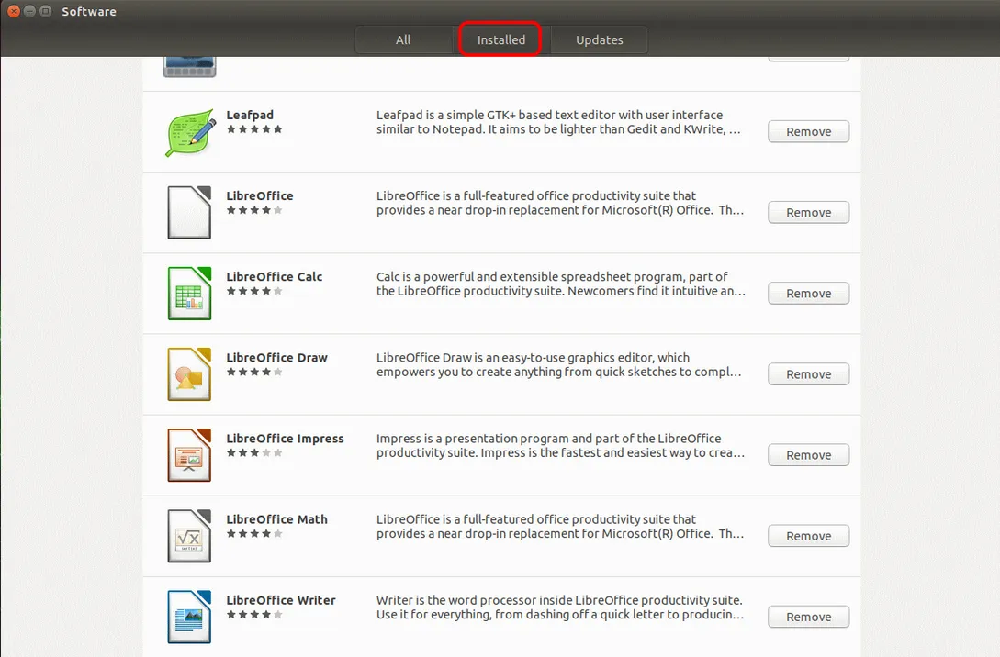

---

## Remove Conflicting Packages

```bash
sudo apt-get remove --purge chromium-browser chromium-browser-l10n
sudo apt-get update
sudo apt-get install nano
sudo apt-get upgrade
sudo apt-get autoremove
```

If an error appears during the upgrade:

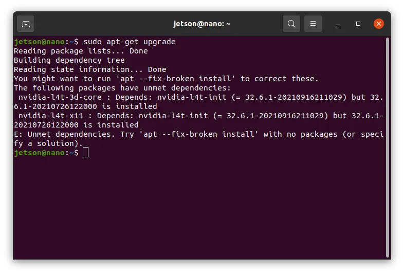

---

## Enable Distribution Upgrade

Edit the following file:

```bash
sudo nano /etc/update-manager/release-upgrades
```

Change it to:

```text
Prompt=normal
```


---

## Refresh System & Reboot

```bash
sudo apt-get update
sudo apt-get dist-upgrade
sudo reboot
```

---

## Upgrade to Ubuntu 20.04

```bash
sudo do-release-upgrade
```

While the process runs:

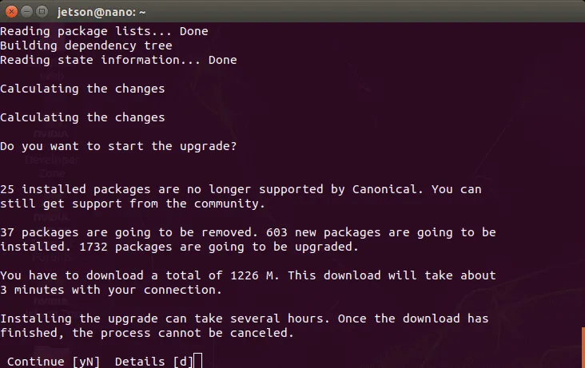

> Always choose the default option and ignore Ubuntu 21.04 notifications.

---

## Important: Do Not Reboot Yet

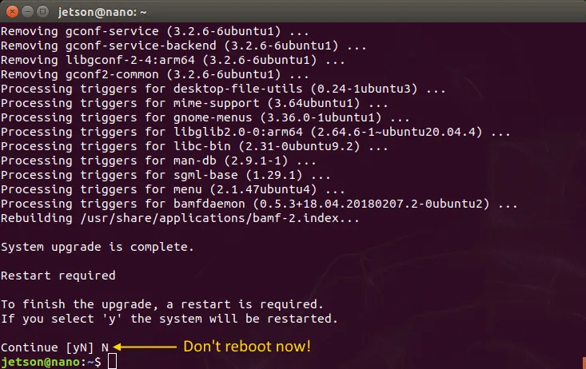

Before rebooting, apply the following configuration fixes.

---

## Configuration Fixes

### Disable Wayland

```bash
sudo nano /etc/gdm3/custom.conf
```

Ensure the following line is enabled:

```text
WaylandEnable=false
```

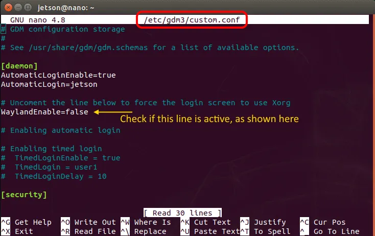

---

### Enable NVIDIA Driver

```bash
sudo nano /etc/X11/xorg.conf
```

Uncomment the line:

```text
Driver "nvidia"
```

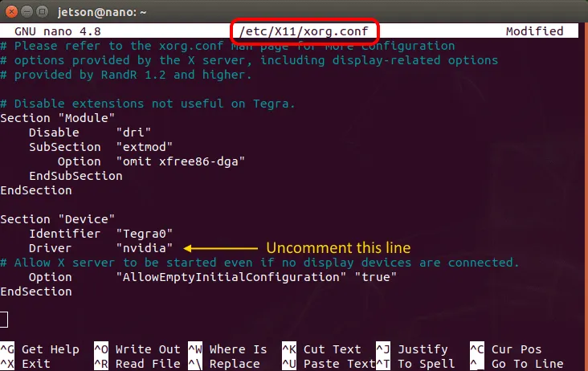

---

### Reset Upgrade Manager

```bash
sudo nano /etc/update-manager/release-upgrades
```

Set it back to:

```text
Prompt=never
```

---

## Reboot System

```bash
sudo reboot
```

---

## Post-Install Cleanup

```bash
sudo apt-get update
sudo apt-get upgrade
sudo apt-get autoremove
sudo rm -rf /usr/share/vulkan/icd.d
```

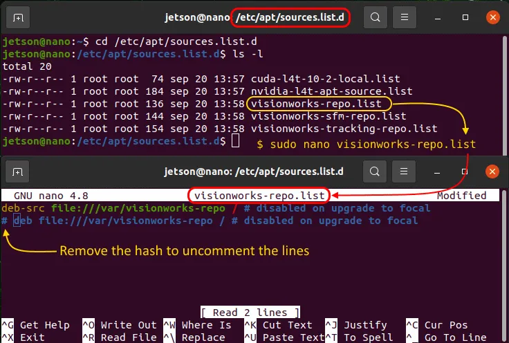

---

## UI Fixes

```bash
sudo rm /usr/share/applications/vpi1_demos
cd /usr/share/nvpmodel_indicator
sudo mv nv_logo.svg no_logo.svg
```

---

## Install GCC 8 (CUDA Requirement)

```bash
sudo apt-get install gcc-8 g++-8
sudo update-alternatives --install /usr/bin/gcc gcc /usr/bin/gcc-9 9
sudo update-alternatives --install /usr/bin/gcc gcc /usr/bin/gcc-8 8
sudo update-alternatives --install /usr/bin/g++ g++ /usr/bin/g++-9 9
sudo update-alternatives --install /usr/bin/g++ g++ /usr/bin/g++-8 8
```

Select the compiler version:

```bash
sudo update-alternatives --config gcc
sudo update-alternatives --config g++
```

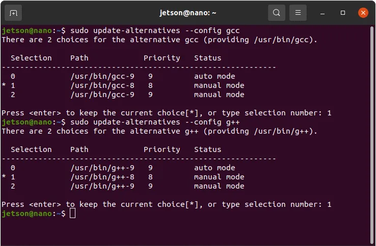

---

## Fixing Upgrade Errors

If the upgrade fails:

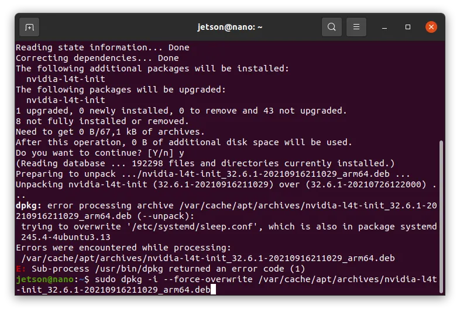

Solution:

```bash
sudo dpkg -i --force-overwrite /path/to/nvidia-l4t-init.deb
```

If successful:

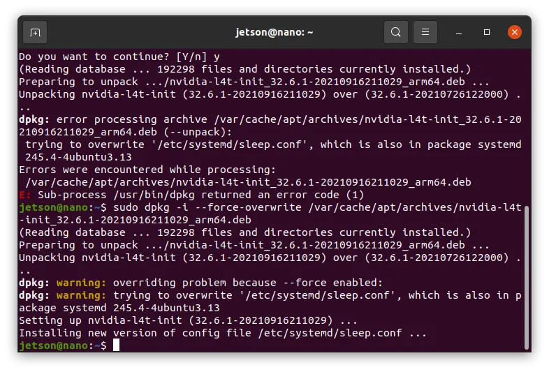

---

## Quick Flash Option

If you prefer to flash Ubuntu 20.04 directly instead of upgrading, you can download the pre-configured image:

**Download Link:** [Ubuntu 20.04 Image for Jetson Nano](https://ln5.sync.com/dl/7261d3770/view/default/11304887590004?sync_id=0#jebr2z9k-kwj4wwvd-3wxjtqsx-36zbu3cx)

Simply flash this image to your SD card using tools like Etcher or `dd` command.

---

## Automated Installation

For convenience, two shell scripts are provided to automate the entire upgrade process:

### Before Reboot

Run the first script to prepare and upgrade the system:

```bash
chmod +x before-reboot.sh
./before-reboot.sh
```

This script will:
- Remove conflicting packages
- Update and upgrade the system
- Enable distribution upgrade
- Upgrade to Ubuntu 20.04
- Apply configuration fixes (Wayland, NVIDIA)
- Automatically reboot the system

### After Reboot

After the system reboots, run the second script:

```bash
./after-reboot.sh
```

This script will:
- Perform post-install cleanup
- Apply UI fixes
- Install GCC 8 for CUDA compatibility

---

## Final Result

Ubuntu 20.04 successfully running on Jetson Nano.

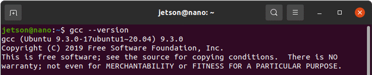

